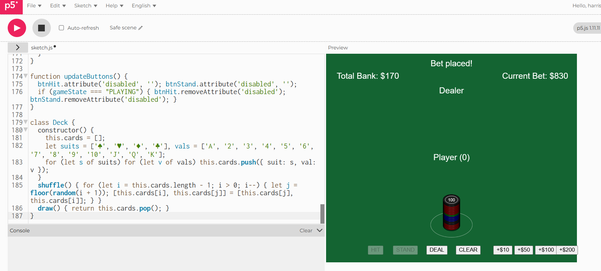
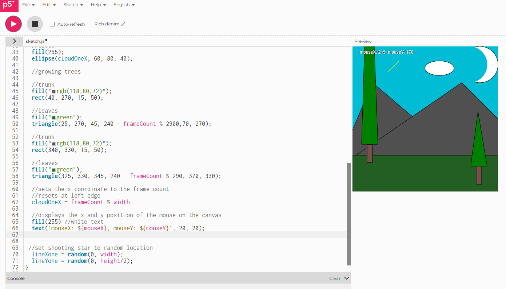
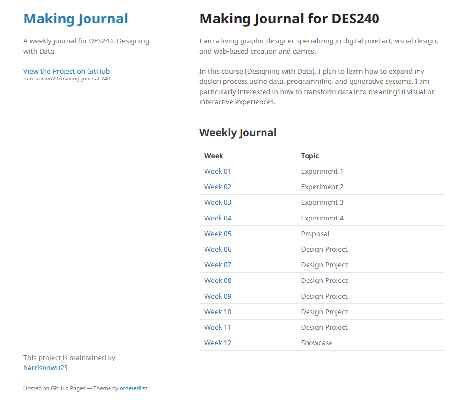
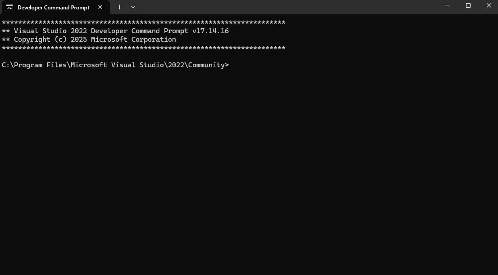

# Week 03

[← Back to Home](../index.md)

# DES240 Experiment 3: Live Data

### Pair Exchange of data portrait

*"for the The Blackjack Code you provided, add visual bet coin of p5js code into 10,50,100,200 bet coin" (Google Gemini, 2026).*

*add tryee and star animation*

I've shared my p5.js animation sketch and Vibe coding one of Black Jack's animations with my pairs. Since I had two presentations, viewers could compare the two sketches through interaction and observation. He felt the game generated by Vibe coding was more interesting and provided an experience similar to playing a real game.

During the coding process, I used a tutorial to create the p5.js animation sketch, while Black Jack was created using Vibe coding. If I had more time, I would add more visual, audio, and interactive enhancements to Black Jack, as Vibe coding is likely to become a technology I use frequently in the future.

# Setting up website

 *my website paeg*

 *image working on site*

During this process, I discovered that the images were not displaying correctly on the website. I initially thought the problem was that the image names in the resource files should ideally use hyphens instead of spaces, but it turned out that a "../" was missing at the beginning. Furthermore, the images still weren't displaying after the change because my website's cache was still interpreting the old path, preventing them from showing up.

## Pair Exchange

Check each other’s journal to ensure:

- [x] file structure is correct, no rogue files
- [x] images are stored in /assets/week-XX/
- [x] all links to images/media are working
- [x] Markdown formatting is consistent
- [x] website published
- [x] images/media display correctly online

I've checked with others and everything is working in the file and website.

# Activity 1 - Explore with with curl (terminal)

*Terminal*

*Navigating Files & Folders*

finding files and folder by using terminal

*Create file*

*text file in desktop*

Tried with using terminal to create a file in desktop

## Demo 1 ASCII Animations

## Demo 2 Weather

## Demo 3 Filtering Live Data

.gif)

## Demo 4 Raw Data (JSON)

While this is not easy to read in a terminal, this type of material can be parsed, filtered, and visualized through procedural code.

the tools and services are open source and code availbale on github such as curl, ascii.live ,wttr.in, Free Dictionary API

# Activity 2

# Activity 3 Design a Data Protocol

I designed a system to measure the volume of sounds in the surrounding environment. The frequency is to collect data every 10 seconds, and the mapping ranges from quiet (small squares), medium (medium squares), to loud (large squares). If there is no sound for more than 10 seconds, a line is drawn.

After revising my data protocol, some parts intrigued me. For example, I didn't specifically configure whether the next record should be placed next to the previous one, but this seemed to be based on habitual recording, and the volume of some recorded times maintained a rhythm from low to high, except for a few particularly loud nodes that surprised me.

The other party expected zero people to be standing, but that wasn't the case, and the number of people varied more than he anticipated.

This showed me how observation can reveal information that pure data collection alone cannot obtain. Our scenario was a class with a large number of students, and it was nearing the end of the get-out-of-class time. In addition to the teacher remaining standing, students leaving and people standing to chat also affected the data.

# Independent Study

- [x] Complete Experiment 3: Live Data
- [x] Choose between digital and analogue practices
- [x] Consider meaningful applications of the tools and techniques (draw on ideas and themes from the practitioner examples)
- [x] Document your process: sketches, screenshots, code snippets, reflections

# Reflection

## AI Usage Statement

Gemini 3 is used to help me clarify the task and tech issue I faced during the process(understand is better to make video to .gif so it can work through most place)

Grammarly used to correct my grammar and writing.

ChatGPT used the same prompt as I sent to Gemini to compare the information for accuracy.

Google. (2026). Gemini 3 Flash (April 1 version) [Large language model]. https://gemini.google.com/

Grammarly Inc. (2026). Grammarly (Version 1.2.3) [Computer software]. https://www.grammarly.com/

OpenAI. (2026). ChatGPT (Mar 14 version) [Large language model]. https://chat.openai.com/