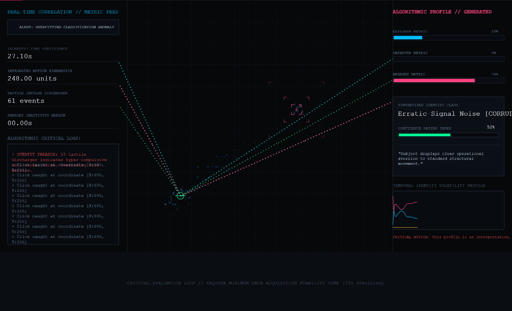

# Week 08

[← Back to Home](../index.md)

# DES240 8: Feedback, Critique, and Project Direction

# Class Activities

* Progress Report Presentation
* Structured Peer Feedback
* Critical Design Proposition
* Project Reflection
* Prototype Development

---

# Progress Report

## Project Overview

The purpose of ECHO//PROFILE is to explore how digital systems collect behavioural information and construct interpretations of identity.

Rather than visualising data through traditional graphs or statistics, the project transforms behavioural information into generated profiles, interpretations, and reflective experiences.

The project currently consists of:

* Behaviour Tracking System
* Data Collection Interface
* Interpretation Logic
* Profile Generation System
* Reflection Layer

---

## Progress Report Slides

I was unable to attend the class presentation session this week. However, I shared my progress report slides and project updates with several classmates afterwards and discussed the project with them to gather feedback.


### Topics Shared

* Project concept
* Data collection prototype
* Behaviour interpretation
* Atmosphere visualisation system
* Critical reflection
* Future development

---

## Feedback Questions

### Question 01

How visible should the interpretation process be?

### Question 02

Should the generated profile appear trustworthy or questionable?

### Question 03

How can uncertainty be communicated within behavioural data?

---

# Progress Report Feedback

## Feedback Documentation

Since I was not present during the in-class feedback session, I followed up with classmates after class and collected feedback through conversations and shared documentation.

### Technical Feedback

Several classmates suggested that the prototype currently focuses heavily on data collection but does not yet clearly demonstrate how collected information transforms into visual outputs.

Key comments included:

> "I understand the data collection, but I want to see the transformation."

> "The visualisation could respond more directly to behaviour."

This suggested that the next stage should focus on visualising interpretation rather than simply displaying tracked data.

---

### Conceptual Feedback

Several classmates were interested in the relationship between identity and algorithmic interpretation.

Comments included:

> "What if the profile is wrong?"

> "Could users disagree with the system?"

> "How much should the system actually know?"

This reinforced the critical aspect of the project and highlighted opportunities for reflection and uncertainty.

---

### Key Insight

The most significant feedback suggested that the project becomes strongest when it reveals the limitations of algorithmic interpretation rather than attempting to create an accurate profile.

This shifted the focus from prediction towards critical reflection.

---

# Critical Design Proposition

## Partner Project Review

Although I was unable to participate in the in-class activity, I reviewed a classmate's project afterwards and discussed it with them.

The project explored behavioural information through visual interaction.

The most interesting aspect was the relationship between user actions and generated outputs.

However, I felt the future implications of the system could be communicated more strongly.

---

## My Critical Design Proposition

### Proposal Title

"What if the system intentionally misunderstood the user?"

Rather than attempting to generate accurate interpretations, the system would occasionally produce incorrect assumptions.

Example:

```text
User Behaviour
      ↓
System Interpretation
      ↓
Incorrect Profile
      ↓
User Reflection
```

This approach would encourage users to question how algorithmic systems construct identity.

---

## Proposition Sketch


**Figure 1** Speculative Design Sketch Investigating Behaviour, Interpretation, and Reflection.

Diagram illustrating a speculative interaction where behavioural data is transformed into potentially inaccurate interpretations, prompting users to question how meaning is constructed from digital traces. Created by author.

### Reflection

This exercise helped me recognise that misinterpretation may be more interesting than accuracy.

The value of the project may lie in exposing uncertainty rather than producing reliable profiles.

---

## Significant Feedback

The most influential feedback focused on uncertainty and interpretation.

While my original prototype attempted to construct behavioural profiles from collected information, several comments highlighted the limitations of this approach.

Classmates repeatedly questioned whether the generated profile should be trusted and whether users should be able to challenge the system's conclusions.

This feedback shifted my understanding of the project.

Rather than creating an accurate representation of identity, the project may be more effective when it reveals the assumptions, biases, and uncertainties involved in behavioural interpretation.

The critical design proposition further reinforced this idea by exploring intentional misinterpretation as a design strategy.

As a result, I decided to focus future development on making interpretation visible, uncertain, and open to challenge.

This direction aligns more strongly with Data Humanism by encouraging reflection on how digital systems construct meaning from incomplete information.

---

# Project Development


**Figure 2** Week 8 prototype exploring how behavioural data is transformed into algorithmic interpretations, confidence assessments, and generated identity profiles.

<iframe src="https://editor.p5js.org/harrisonwu23/full/UZPtoSlw6"></iframe>


<details>
<summary><b>Click to check： Prompt to gemini</b></summary>
Based on the current p5.js prototype for ECHO//PROFILE, create a more advanced Week 8 version.

Keep all existing functionality:

- WASD movement
- Behaviour tracking
- Distance travelled
- Click count
- Idle time
- Session time
- Movement trail
- Particles
- Click ripples
- Explorer / Observer / Engaged scores
- Reflection prompt
- Behaviour logs

Do NOT remove any existing systems.

The purpose of this iteration is to explore uncertainty, interpretation, and algorithmic profiling.

The prototype should now feel less like a tracking tool and more like a system constructing assumptions about the user.

--------------------------------------------------
1. Add Interpretation Confidence
--------------------------------------------------

Create:

Confidence Level: XX%

Display:

SYSTEM CONFIDENCE

The confidence value should increase based on:

- Session duration
- Amount of behaviour recorded
- Number of interactions

Example:

15 seconds = 20%

45 seconds = 55%

90 seconds = 85%

Display:

"This profile is an interpretation, not a fact."

--------------------------------------------------
2. Add Profile Uncertainty
--------------------------------------------------

The system should occasionally display uncertain statements.

Examples:

"We believe you enjoy exploration."

"It is possible that you prefer observation."

"The system is unsure."

"Insufficient behavioural evidence."

This should change dynamically.

--------------------------------------------------
3. Add Misinterpretation Events
--------------------------------------------------

Every 20-30 seconds create a small chance that the system generates a questionable interpretation.

Examples:

"You dislike interaction."

even when interaction is high.

Display:

"Possible Misclassification Detected"

This supports the project's critical design concept.

--------------------------------------------------
4. Create Behaviour → Profile Visualisation
--------------------------------------------------

Add animated connections showing:

Distance Travelled
↓
Explorer Score

Idle Time
↓
Observer Score

Click Count
↓
Engaged Score

The user should visually understand how behaviour affects profile generation.

--------------------------------------------------
5. Improve Profile Panel
--------------------------------------------------

Create a more detailed profile card.

Display:

PROFILE GENERATED

Explorer: XX%
Observer: XX%
Engaged: XX%

Primary Identity:

Explorer

Confidence:

67%

Assessment:

"The system believes you seek exploration."

Visualise scores using bars.

--------------------------------------------------
6. Add Reflection Layer
--------------------------------------------------

After 60 seconds display:

DO YOU AGREE WITH THIS PROFILE?

[ AGREE ]
[ DISAGREE ]

When clicked:

Display:

User Response Recorded

OR

Profile Challenged

Keep responses visible.

--------------------------------------------------
7. Improve Screenshot Quality
--------------------------------------------------

The layout should be clearly divided:

LEFT
RAW DATA

CENTER
INTERACTION SPACE

RIGHT
PROFILE PANEL

BOTTOM
REFLECTION LAYER

Make it easy to screenshot for a design blog.

--------------------------------------------------
8. Code Requirements
--------------------------------------------------

- Clean and commented
- Organised into functions
- Easy to modify
- Use only p5.js
- No external assets
- No external libraries

The final result should feel like an experimental academic data visualisation prototype rather than a game.

Focus on:

Behaviour
↓
Interpretation
↓
Profile Generation
↓
Uncertainty
↓
Reflection

Provide complete p5.js code only.</details>


## Development Goal

Based on the feedback received, I focused on strengthening the relationship between:

```text
Behaviour
      ↓
Data Collection
      ↓
Interpretation
      ↓
Profile
      ↓
Reflection
```

The aim was to make the transformation process more visible.

---

## Experiment 02 — Algorithmic Interpretation & Uncertainty


### Aim

The aim of this experiment was to move beyond simple behaviour tracking and explore how behavioural information can be transformed into uncertain algorithmic interpretations.

Following feedback from the progress report and peer discussions, I recognised that the project became more interesting when it questioned the reliability of behavioural profiling rather than attempting to produce accurate identity classifications.

As a result, this iteration focused on visualising interpretation, confidence, uncertainty, and potential misclassification.

---

### Development Process


**Figure 3** Algorithmically generated identity profile based on behavioural information collected during user interaction.

<iframe src="https://editor.p5js.org/harrisonwu23/full/VFDT0HH6M"></iframe>

The Week 7 prototype primarily functioned as a behaviour-tracking system.

Users could generate behavioural data through movement, clicks, idle time, and interaction patterns. The system then translated this information into profile categories such as Explorer, Observer, and Engaged.

However, feedback revealed that the prototype was still primarily communicating data collection rather than interpretation.

Several comments questioned:

- How does the system reach its conclusions?
- Can the profile be trusted?
- What happens if the system is wrong?

These questions prompted a significant shift in the project's direction.

Rather than improving profile accuracy, I began exploring how uncertainty and algorithmic assumptions could become visible components of the experience.

---

### Prototype Development

The updated prototype introduced several new systems:

#### Interpretation Confidence

The system now generates a confidence level based on the quantity of behavioural information collected.

Examples include:

- Session duration
- Movement activity
- User interactions

This confidence score is displayed alongside the generated profile.

---

#### Profile Assessment

The prototype now produces written interpretations based on collected behavioural information.

Examples include:

```text
"We believe you enjoy exploration."

"It is possible that you prefer observation."

"The system is structurally unsure."
```

#### Misinterpretation Events

A new profiling system was introduced that occasionally generates questionable or conflicting classifications.

For example, the system may assign a behavioural label that does not accurately reflect the user's actions.

These moments are intentionally designed to expose the assumptions embedded within algorithmic interpretation systems.

Rather than presenting the generated profile as objective truth, the prototype demonstrates how digital systems can appear confident while operating on incomplete information.

This became one of the most important conceptual developments of the project.

## Learning Outcomes

This experiment significantly changed both the technical and conceptual direction of the project.

From a technical perspective, I developed a more advanced behaviour interpretation system that combined behavioural tracking, profile generation, confidence calculations, and dynamic interface updates. Implementing these systems required experimenting with variable weighting, rule-based classification, temporal data sampling, and real-time visual feedback.

The addition of confidence indicators and profile assessment statements revealed how easily behavioural information can be transformed into convincing interpretations. Even relatively simple data points such as movement distance, idle time, and click frequency were capable of producing highly specific identity classifications.

However, the most important learning outcome was conceptual rather than technical.

During development, I realised that the project became more interesting when the system occasionally produced incorrect assumptions. The introduction of misclassification events demonstrated how algorithmic systems can appear highly confident despite operating on incomplete information.

This shifted the project away from accuracy and prediction towards uncertainty and interpretation. Rather than asking whether the generated profile is correct, the project now encourages users to question how such profiles are constructed in the first place.

As a result, ECHO//PROFILE has evolved from a behavioural visualisation system into a critical exploration of algorithmic profiling, identity construction, and the assumptions embedded within data-driven systems.

---

# Design Direction Shift

The original project plan focused on transforming behavioural information into generated identity profiles.

Initially, I expected the project to investigate whether behavioural data could accurately represent aspects of a user's identity. The profile generation system was intended to function as the primary outcome of the experience.

However, feedback received during the progress report highlighted a different area of interest.

Several comments questioned:

* What if the profile is wrong?
* Could users disagree with the system?
* How much should the system actually know?
* Why should the generated profile be trusted?

These questions encouraged me to reconsider the purpose of the project.

Rather than improving profile accuracy, I became increasingly interested in exposing the uncertainty, assumptions, and biases involved in behavioural interpretation.

This resulted in a shift from:

```text
Behaviour
      ↓
Profile Generation
```

towards:

```text
Behaviour
      ↓
Interpretation
      ↓
Misinterpretation
      ↓
Reflection
```

This change significantly strengthened the project's critical dimension and aligned more closely with themes of Data Humanism, algorithmic profiling, and digital identity.

The project now focuses less on constructing identities and more on questioning how digital systems construct identities from incomplete behavioural information.

---

# Technical Skill Building

## Skill Development — Algorithmic Interpretation Systems

### New Skills Developed

* Behaviour weighting systems
* Rule-based profile generation
* Confidence calculations
* Dynamic profile updates
* Behavioural data visualisation
* Temporal data sampling
* Interface hierarchy design
* Real-time user feedback systems

### Example Interpretation Logic

```text
Distance Travelled
      ↓
Explorer Score

Idle Time
      ↓
Observer Score

Click Count
      ↓
Engaged Score

Session Duration
      ↓
Confidence Level
```

### Updated System Architecture

```text
User Input
      ↓
Behaviour Tracking
      ↓
Behaviour Dataset
      ↓
Interpretation Engine
      ↓
Profile Generation
      ↓
Confidence Calculation
      ↓
Reflection Layer
```

### Technical Reflection

This development phase highlighted that interpretation systems are fundamentally designed rather than discovered.

Every profile generated by the prototype depends on assumptions embedded within the code. Changing the weighting of behavioural variables can completely alter the resulting profile, despite the underlying data remaining the same.

This reinforced one of the central ideas behind the project: data itself is not inherently meaningful. Meaning emerges through interpretation systems, and those systems are shaped by human decisions, assumptions, and biases.

---

# Next Development Priorities

### Priority 01 — Atmosphere Generation

The current prototype focuses primarily on interface-based interpretation.

The next stage will explore how behavioural information can influence environmental and atmospheric changes, allowing identity construction to be communicated through visual experience rather than solely through text.

---

### Priority 02 — Uncertainty Visualisation

Future iterations will investigate how uncertainty can become a visible component of the experience.

Rather than displaying a single profile result, the system may visualise multiple possible interpretations simultaneously.

---

### Priority 03 — User Challenge System

The current reflection layer allows users to agree or disagree with generated profiles.

Future development will explore more meaningful ways for users to challenge, modify, or resist algorithmic classifications.

---

### Priority 04 — Profile Volatility

The prototype currently generates relatively stable profiles.

Future versions may allow identities to fluctuate more dramatically over time, highlighting how behavioural interpretation is constantly changing and never fully complete.

---

# Reflection

This week marked an important turning point for the project.

While previous iterations focused primarily on behavioural tracking and profile generation, the feedback process encouraged me to think more critically about the assumptions underlying these systems.

The most valuable insight was recognising that uncertainty may be more meaningful than accuracy.

Originally, I approached the project as an investigation into how behavioural information could generate identity profiles. However, the development of misclassification systems revealed that the project becomes more engaging when users are encouraged to question the validity of those profiles.

The prototype now exposes the limitations of behavioural interpretation rather than attempting to conceal them.

Through both technical experimentation and critical reflection, I began to understand how digital systems can appear authoritative despite relying on incomplete information. This insight aligns strongly with the principles of Data Humanism and has become a central direction for the project.

Moving forward, I intend to continue exploring uncertainty, interpretation, and user resistance as key components of ECHO//PROFILE. Rather than creating a system that claims to know the user, the project will increasingly focus on revealing how digital systems construct assumptions about people through data.


---

## AI Usage Statement

ChatGPT was used to assist with brainstorming, project planning, documentation structure, reflective writing, and development planning. All experimentation, coding implementation, interpretation, design decisions, and final outcomes were reviewed, modified, and developed by the author.
