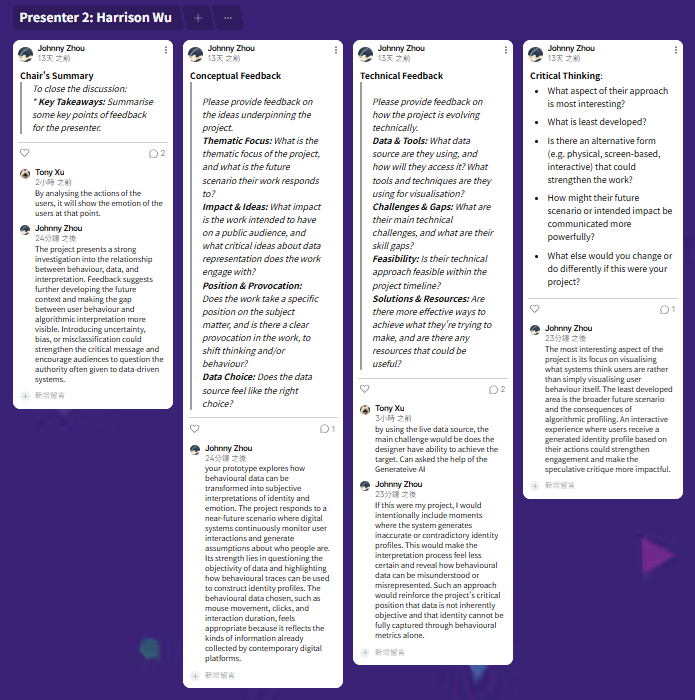

# Week 10

[← Back to Home](../index.md)

# DES240 10: Critique and Action Planning

# Class Activities

* Progress Report Presentation
* Structured Feedback Session
* Padlet Critique Documentation
* Gallery Walk
* Action Planning
* Project Development

---

# Progress Report Feedback

# Progress Report Feedback

## Feedback Documentation

**Figure 1.** Feedback collected during the Week 10 critique session.

---

## Chair's Summary

The feedback highlighted that the project has developed a strong connection between behavioural data, interpretation systems, and critical reflection. Participants recognised that the project successfully moves beyond simple data collection by exposing how behavioural information can be transformed into generated identities and assumptions.

A recurring theme across the feedback was the relationship between behavioural tracking, data interpretation, and uncertainty. Several comments suggested that the project's strongest aspect is not the profile generation itself, but the way it encourages audiences to question the authority of algorithmic systems.

The feedback also identified opportunities to further strengthen the visualisation through uncertainty, misclassification, and more experiential forms of communication.

---

## Conceptual Feedback

Participants responded positively to the project's focus on behavioural interpretation and identity construction.

One reviewer noted that the project explores how behavioural data can be transformed into subjective interpretations of identity and emotion, responding to a near-future scenario in which digital systems continuously monitor user interactions and generate assumptions about individuals.

Another key observation was that the project successfully highlights how behavioural traces can be used to construct identity profiles despite representing only a limited and incomplete view of the individual.

The feedback confirmed that the project's critical position is clearly communicated and that the chosen behavioural dataset effectively supports the intended investigation into algorithmic profiling and digital identity.

---

## Technical Feedback

The technical feedback focused on the relationship between the data source and the intended outcome.

One participant questioned whether the current behavioural dataset is sufficient to achieve the project's objectives and suggested further consideration of how different forms of data might influence the generated profiles.

Another participant suggested that the project could become stronger by introducing moments where the system intentionally generates inaccurate or contradictory identity classifications. This would make the interpretation process feel less certain and expose the limitations of behavioural profiling systems more clearly.

This feedback directly aligned with my recent experiments involving profile volatility, uncertainty systems, and misclassification events.

---

## Critical Thinking

The most significant conceptual feedback focused on future development opportunities.

One participant suggested that the most interesting aspect of the project is not the visualisation itself but the broader future scenario it raises: a world where digital systems continuously generate identity profiles based on behavioural information.

This comment encouraged me to think beyond the interface and consider how the project might communicate larger questions about algorithmic authority, surveillance, and identity construction.

The feedback suggested that the speculative dimension of the project could become even more impactful if the behavioural profiling system was positioned as part of a wider future social condition rather than only an individual interaction.

---

## Key Insights

Three key insights emerged from the critique session:

1. The relationship between behavioural data, interpretation, and uncertainty remains the strongest aspect of the project.

2. Misclassification and contradictory profiling may provide a more compelling critical experience than attempting to create accurate identity profiles.

3. The future implications of behavioural profiling systems deserve greater emphasis as the project moves towards the final showcase.

These insights will directly inform the next stage of development.

---

## Response to Feedback

In response to the critique session, I will continue developing systems that visualise uncertainty, profile instability, and algorithmic assumptions.

Rather than improving the accuracy of the generated profiles, I intend to further explore how digital systems create convincing yet potentially unreliable interpretations from incomplete behavioural information.

I will also investigate how atmosphere, environmental behaviour, and visual transformation can communicate these ideas more effectively than interface panels alone.

This direction aligns closely with the project's focus on Data Humanism and strengthens its critical engagement with behavioural profiling and digital identity.

---

# Action Plan

## Reflective Summary

The feedback session helped clarify the most significant strengths and opportunities within the project.

A recurring theme across the feedback was the relationship between behavioural data, interpretation, and identity construction. Participants recognised that the project successfully demonstrates how behavioural information can be transformed into assumptions and classifications about individuals. This confirmed that the project's core concept is clearly communicated and that the chosen data source supports the intended investigation.

One of the most valuable suggestions focused on the limitations of behavioural profiling systems. Feedback highlighted that behavioural information only captures a partial view of a person and may not accurately represent their intentions, emotions, or identity. This reinforced my interest in uncertainty and misclassification as critical components of the project.

Another important observation concerned the future implications of behavioural profiling. Participants suggested that the broader scenario of continuously generated identity profiles may be more compelling than the interface itself. This encouraged me to think beyond individual interactions and consider how algorithmic profiling systems might influence society more broadly.

As a result, my next stage of development will focus on strengthening uncertainty, profile instability, and misclassification systems. Rather than improving profile accuracy, I will continue exploring how behavioural data can generate convincing yet potentially unreliable interpretations. This direction aligns strongly with Data Humanism by questioning the authority of data-driven systems and exposing the assumptions embedded within algorithmic interpretation.

---

## Action Points

### Priority 01

Reduce reliance on profile panels.

---

### Priority 02

Expand atmosphere generation.

---

### Priority 03

Visualise uncertainty through environmental behaviour.

---

### Priority 04

Strengthen profile instability and volatility.

---

### Priority 05

Prepare a refined prototype for Week 12 showcase.

---

# Project Development

## Experiment 04 — Atmosphere and Uncertainty

### Aim

To investigate how uncertainty can be communicated through environmental behaviour rather than interface elements.

---

### Development Overview

Building on the feedback received during the critique session, I refined the atmosphere generation system.

Rather than introducing new profile features, this iteration focused on visual responses generated from behavioural interpretation.

Behavioural information now influences:

* Particle density
* Movement behaviour
* Environmental instability
* Visual noise
* Profile volatility

The goal was to make uncertainty visible without requiring users to read explanatory text.

---

**Figure 2.** Updatedprototype featuring atmosphere generation, profile volatility, and uncertainty visualisation.

Note. Behavioural data influences environmental responses, profile stability, and generated interpretations. Screenshot by author.

<iframe src="https://editor.p5js.org/harrisonwu23/full/oFE_45rZC"></iframe>

<b>Click to check： Prompt to gemini</b>

Based on the current ECHO//PROFILE p5.js prototype, create a Week 10 refined version.

Keep the existing concept and core systems:

- WASD movement
- Behaviour tracking
- Distance travelled
- Click count
- Idle time
- Session time
- Behaviour logs
- Explorer / Observer / Engaged scores
- Confidence system
- Profile volatility
- Misclassification events
- Reflection prompt
- AGREE / DISAGREE interaction

Do NOT remove these systems.

The purpose of this Week 10 iteration is to respond to critique feedback by strengthening:

1. uncertainty
2. misclassification
3. profile instability
4. behavioural interpretation
5. visual atmosphere

The prototype should feel more like a critical data visualisation experience and less like a simple dashboard.

--------------------------------------------------
1. Improved Atmosphere Visualisation
--------------------------------------------------

Create a central visual atmosphere that responds to behavioural data.

Movement:
- Generates directional particles
- Creates visible movement trails
- Expands the atmosphere field

Idle:
- Creates soft circular aura zones
- Slows particle motion
- Makes the atmosphere feel suspended

Clicks:
- Generate ripple waves
- Create sharp signal bursts
- Increase visual activity

The central area should be visually strong enough to screenshot as an “Atmosphere Detail Screenshot”.

--------------------------------------------------
2. Behaviour → Interpretation Connection
--------------------------------------------------

Make it visually clear that user behaviour affects the generated profile.

Add subtle animated lines or data streams connecting:

Movement → Explorer
Idle → Observer
Clicks → Engaged

These connections should pulse when the related behaviour increases.

--------------------------------------------------
3. Profile Instability System
--------------------------------------------------

Improve the existing profile volatility system.

The generated identity should sometimes shift between:

Explorer
Explorer?
Observer?
Engaged?
Unclassified
Misread Signal

The profile should feel unstable rather than final.

Add a label:

PROFILE STABILITY: XX%

Profile stability should decrease when:
- misclassification occurs
- user disagrees with the profile
- behaviour patterns conflict

--------------------------------------------------
4. Misclassification Events
--------------------------------------------------

Every 20–30 seconds, trigger a possible misclassification event.

Examples:

“Possible Misclassification Detected”

“Behavioural evidence is incomplete.”

“Profile revised.”

“Contradictory signal detected.”

When this happens:
- profile label flickers
- confidence briefly drops
- atmosphere becomes visually unstable
- data log records the event

This supports the critical idea that behavioural profiling can be convincing but unreliable.

--------------------------------------------------
5. Confidence and Uncertainty
--------------------------------------------------

Keep the confidence system, but make it more critical.

Display:

CONFIDENCE: XX%

Also display:

“This profile is an interpretation, not a fact.”

Confidence should not simply mean truth.
It should represent how confident the system feels, even if the interpretation may be wrong.

--------------------------------------------------
6. Reflection Layer
--------------------------------------------------

After 60 seconds, show:

DO YOU AGREE WITH THIS PROFILE?

[ AGREE ] [ DISAGREE ]

If DISAGREE is clicked:
- reduce confidence
- reduce profile stability
- trigger visual glitch / instability
- log: “User challenged the system profile.”

If AGREE is clicked:
- log: “User accepted the system profile.”
- slightly increase confidence

--------------------------------------------------
7. Screenshot-Friendly Layout
--------------------------------------------------

The layout should be clear for documentation screenshots:

LEFT:
Raw Behavioural Data

CENTER:
Atmosphere Visualisation

RIGHT:
Generated Profile + Confidence + Stability

BOTTOM:
Reflection Layer + System Log

Make sure the full screenshot clearly shows the whole system.

Also ensure the central atmosphere area looks strong enough for a cropped screenshot.

--------------------------------------------------
8. Code Screenshot Section
--------------------------------------------------

Organise the code so I can easily screenshot these functions:

- updateAtmosphere()
- updateProfileStability()
- triggerMisclassification()
- calculateConfidence()
- generateInterpretation()

Add clear comments above these functions explaining what they do.

--------------------------------------------------
9. Visual Style
--------------------------------------------------

Use only p5.js drawing functions.

Style:
- Minimal
- Academic
- Data visualisation
- Slightly speculative / critical
- No external assets
- No external libraries

The prototype should not feel like a game.
It should feel like an experimental critical data visualisation.

--------------------------------------------------
10. Final Output
--------------------------------------------------

Provide complete p5.js code only.

The final prototype should support these three documentation screenshots:

1. Updated Prototype Screenshot — full interface
2. Atmosphere Detail Screenshot — central visualisation area
3. Code Screenshot — uncertainty / confidence / misclassification functions

---

## Development Reflection

This iteration revealed that atmosphere can communicate uncertainty more effectively than textual profile descriptions.

While previous versions relied on confidence percentages and generated statements, environmental behaviour provided a more immediate and intuitive form of communication.

The atmosphere layer began functioning as a visual representation of interpretation itself, allowing users to experience instability rather than simply being told about it.

This marked an important shift from interface design towards data-driven visualisation.

---

# Current Project Status

## Completed

* Behaviour Tracking System
* Behaviour Logging
* Profile Generation
* Confidence Calculations
* Misclassification Events
* Reflection Layer
* Profile Volatility
* Atmosphere Generation

---

## Currently Refining

* Uncertainty Visualisation
* Environmental Responses
* Behaviour-Driven Atmosphere
* Showcase Presentation

---

## Direction for Week 11

The next stage of development will focus on refining the visual experience and preparing a coherent showcase version of the project.

Priority will be given to atmosphere generation, uncertainty communication, and overall presentation quality.

---

# Reflection

This week helped clarify the final direction of the project.

The critique session revealed that the most compelling aspect of ECHO//PROFILE is not the generated profile itself but the uncertainty surrounding that profile.

Participants consistently questioned why the system should be trusted and how it reached its conclusions. This confirmed that the project is most effective when it exposes the assumptions embedded within algorithmic interpretation rather than attempting to produce accurate classifications.

The feedback also encouraged me to reconsider the role of atmosphere within the project. Initially, atmosphere functioned as a supporting visual layer. Through development and critique, it has gradually become one of the primary methods through which interpretation is communicated.

This shift aligns more closely with the goals of Data Humanism by emphasising experience, ambiguity, and reflection over objective representation.

Moving forward, I will focus on refining atmosphere generation and uncertainty visualisation while preparing the project for the Week 12 showcase.

---

## AI Usage Statement

ChatGPT was used to assist with brainstorming, documentation structure, critique analysis, action planning, reflection writing, and development planning. All experimentation, coding implementation, interpretation, design decisions, and final outcomes were reviewed, modified, and developed by the author.
