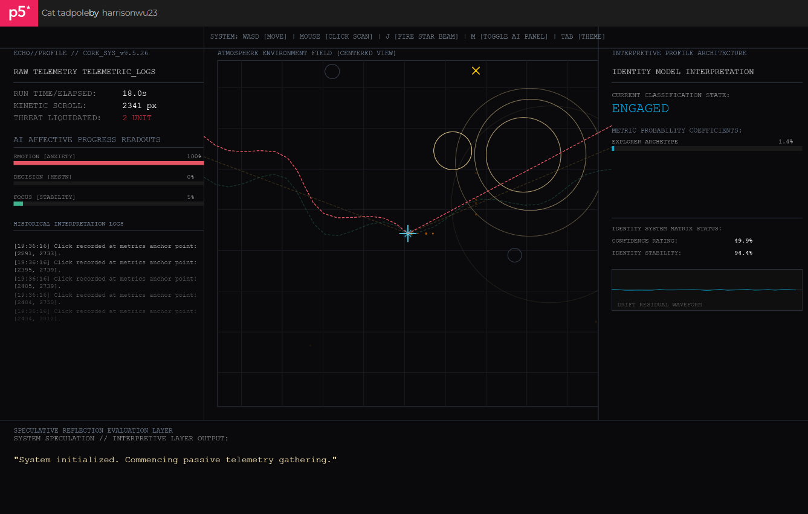

# Week 11

[← Back to Home](../index.md)

# DES240 11: Project Finalisation and Showcase Preparation

# Class Activities

* Journal Review
* Practice Consultation
* Showcase Planning
* Project Finalisation
* Studio Consultation Preparation

---

# Journal Review

## Reviewing the Development Process

Revisiting my journal entries from Weeks 6–10 allowed me to reflect on how the project evolved over time.

What began as an exploration of behavioural tracking gradually developed into a critical investigation of algorithmic interpretation, uncertainty, and identity construction.

Reviewing earlier prototypes made it clear that the project's direction shifted significantly through experimentation, critique, and reflection rather than following a fixed plan.

This process helped identify several key moments that shaped the final outcome of the project.

---

## Key Moment 01 — From Data Collection to Interpretation

The earliest prototypes focused primarily on collecting behavioural information such as movement, clicks, idle time, and session duration.

Initially, I viewed these data points as the central component of the project.

However, experimentation revealed that the data itself was less interesting than the meanings assigned to it.

This led to a shift towards behavioural interpretation and profile generation.

---

## Key Moment 02 — The Introduction of Uncertainty

One of the most important turning points emerged through critique and feedback discussions.

Several participants questioned whether the generated profiles could actually be trusted.

This challenged my original assumption that the system should attempt to produce accurate interpretations.

Instead, I began introducing uncertainty, confidence systems, profile volatility, and misclassification events.

This transformed the project from a profiling system into a critical exploration of algorithmic authority.

---

## Key Moment 03 — Atmosphere as Interpretation

As development progressed, I became increasingly interested in atmosphere generation.

Rather than communicating interpretation through interface panels alone, I began exploring how behavioural information could influence visual conditions and environmental responses.

This shifted the project towards a more experiential form of data visualisation and aligned more closely with the principles of Data Humanism.

---

# Practice Consultation Reflection

## What Went Well?

During practice consultations, I found that I was able to clearly explain the relationship between behavioural data, interpretation, and identity construction.

The overall concept of ECHO//PROFILE was generally easy to communicate, and participants understood the project's critical focus on behavioural profiling systems.

---

## Areas for Improvement

While discussing the project, I noticed that I sometimes focused too heavily on describing individual features rather than communicating the broader argument behind the work.

In future discussions, I will place greater emphasis on the project's central question:

> Why do we trust systems that claim to understand us through data?

This question more effectively communicates the project's critical position than explaining technical features individually.

---

## Consultation Preparation Notes

For the Studio Consultation, I want to improve:

* Explaining the project's critical position more concisely.
* Connecting prototype features to broader concepts of Data Humanism.
* Communicating why uncertainty is more important than accuracy within the project.
* Explaining how atmosphere functions as a form of behavioural interpretation.

---

# Showcase Planning


## Showcase Concept

The final presentation will display ECHO//PROFILE as an interactive behavioural interpretation system.

Visitors will be able to interact with the prototype and observe how behavioural information is transformed into generated interpretations, confidence assessments, and unstable identity classifications.

The showcase will encourage participants to reflect on how digital systems collect, interpret, and reconstruct personal identity through behavioural information.

---

## Intended Audience Experience

The intended experience follows the sequence:

```text
Interact
      ↓
Generate Data
      ↓
Generate Profile
      ↓
Question Interpretation
      ↓
Reflect
```

Rather than encouraging users to trust the system, the experience aims to make them question its authority.

---

## Installation Plan

The prototype will be displayed on a laptop or monitor where visitors can directly interact with the system.

The interface will remain visible throughout the interaction, allowing users to observe the relationship between behavioural input, generated interpretations, and uncertainty systems.

The focus will be on participation, observation, and reflection.

---

# Project Finalisation

## Final Project Statement

### ECHO//PROFILE

ECHO//PROFILE is an interactive data-driven visualisation that explores how digital systems construct assumptions about identity through behavioural information.

The project investigates a speculative scenario in which user behaviour is continuously monitored and translated into generated profiles, classifications, and interpretations.

Rather than presenting these interpretations as objective truth, the project exposes the uncertainty, instability, and assumptions embedded within behavioural profiling systems.

Through atmosphere generation, profile volatility, confidence calculations, and reflection systems, ECHO//PROFILE encourages audiences to question the authority of algorithmic interpretation and consider how data shapes perceptions of identity.

---

## Final Project Direction

The project no longer attempts to create accurate behavioural profiles.

Instead, it focuses on exposing the processes through which behavioural information becomes interpretation.

This shift can be summarised as:

```text
Behaviour
      ↓
Data Collection
      ↓
Interpretation
      ↓
Misinterpretation
      ↓
Reflection
```

This direction became the central argument of the project and informed all major development decisions.

---

# Final Artefact Documentation



<a href="https://editor.p5js.org/harrisonwu23/full/2oZHXvL86" target="_blank" style="
  display: inline-block;
  padding: 12px 20px;
  border: 1px solid #111;
  color: #111;
  text-decoration: none;
  font-family: monospace;
  font-size: 14px;
  background: #fff;
">
  Open Interactive Prototype
</a>

<iframe
  src="https://editor.p5js.org/harrisonwu23/full/ZViBNbYpQ"
  width="atuo"
  height="atuo"
  style="
    border: 1px solid #ddd;
    margin-top: 20px;
    margin-bottom: 20px;
  "
  allowfullscreen>
</iframe>

## Development Documentation

The final prototype represents the outcome of several weeks of experimentation, iteration, and refinement. Rather than following a fixed development plan, the project evolved through a process of testing individual systems, evaluating their effectiveness, and gradually integrating them into a more cohesive experience.

Early prototypes focused primarily on behaviour tracking. These experiments successfully recorded movement, clicks, idle time, and session duration, but the experience felt more like a data collection tool than a meaningful visualisation. While the system could generate data, it was not yet communicating why that data mattered.

Subsequent iterations introduced profile generation, confidence calculations, and behavioural interpretation systems. These additions allowed the prototype to transform behavioural information into generated identities such as Explorer, Observer, and Engaged. However, these versions relied heavily on interface panels and textual feedback, making the experience feel more like a dashboard than an interactive visualisation.

Through critique sessions and ongoing reflection, I began shifting the project towards uncertainty, instability, and interpretation. This led to the development of profile volatility systems, misclassification events, confidence fluctuations, and reflection prompts. These features helped expose the limitations of behavioural profiling and reinforced the project's critical focus on algorithmic interpretation rather than behavioural accuracy.

One of the greatest challenges during development was combining these systems into a single coherent experience. Behaviour tracking, atmosphere generation, profile generation, confidence systems, misclassification events, reflection interactions, and environmental visualisation were initially developed separately. Integrating them required significant experimentation and repeated adjustments to ensure that each system responded to behavioural information while still supporting the overall concept.

After multiple iterations, I was able to successfully combine these previously separate features into a unified prototype. Player behaviour now influences atmosphere generation, profile construction, confidence calculations, AI interpretation, and reflection systems simultaneously. This integration transformed the project from a collection of individual experiments into a complete interactive data-driven visualisation.

The final prototype demonstrates how behavioural information can be collected, interpreted, reconstructed, challenged, and reflected upon within a single experience. More importantly, it communicates the project's central argument: that digital systems do not simply record behaviour, but actively construct assumptions about identity through interpretation. Rather than presenting data as objective truth, the prototype reveals the uncertainty, instability, and subjectivity involved in transforming behaviour into identity.


---

# Reflection

Week 11 provided an opportunity to step back from development and evaluate the project as a whole.

Reviewing the journal entries revealed that the most important developments were not technical but conceptual. The project evolved through repeated cycles of experimentation, critique, and reflection, gradually shifting from behavioural tracking towards a critical exploration of algorithmic interpretation.

One of the most significant lessons from the project was recognising that data does not inherently contain meaning. Meaning emerges through interpretation systems, and those systems are shaped by assumptions, biases, and design decisions.

This insight became central to ECHO//PROFILE.

Rather than visualising behavioural data itself, the project now visualises the uncertainty, instability, and authority of the systems that interpret that data.

Preparing for the showcase also reinforced the importance of clarity. The final experience must communicate not only what the system is doing but why it matters.

Moving forward into the Week 12 showcase, my goal is to create an experience that encourages visitors to question the authority of algorithmic systems and reflect on how digital identities are constructed through data.

---

## AI Usage Statement

ChatGPT was used to assist with documentation structure, project reflection, showcase planning, journal organisation, and writing support. All experimentation, coding implementation, interpretation, design decisions, and final project outcomes were reviewed, modified, and developed by the author.
